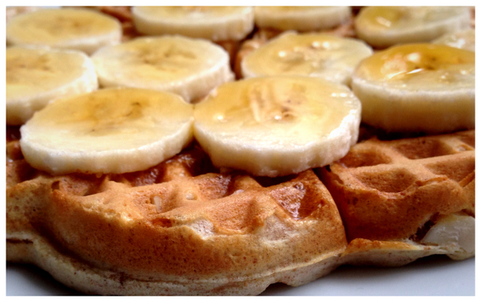

# Waffles

Makes 7 to 8 waffles depending on waffle iron size.

Whisk together in a large bowl 
&nbsp;&nbsp;&nbsp;&nbsp;**1 3/4 cups all-purpose flour** 
&nbsp;&nbsp;&nbsp;&nbsp;**2 teaspoons baking powder** 
&nbsp;&nbsp;&nbsp;&nbsp;**1/2 teaspoon salt** 
&nbsp;&nbsp;&nbsp;&nbsp;**1 tablespoon sugar** 
In another bowl combine 
&nbsp;&nbsp;&nbsp;&nbsp;**3 egg yolks** 
&nbsp;&nbsp;&nbsp;&nbsp;**7 tablespoons vegetable oil** 
&nbsp;&nbsp;&nbsp;&nbsp;**1 1/2 cups milk** 
Pour the wet ingredients over the dry ingredients and mix well
In another bowl beat until stiff but not dry 
&nbsp;&nbsp;&nbsp;&nbsp;**3 egg whites** 
Fold them into the batter just until blended

Cook time depends on waffle iron and settings

**Recommendations:**
  * Whole wheat flour is recommended, or make it half white and half whole wheat
  * After pouring the batter into the waffle iron sprinkle sliced almonds or crushed walnuts over it
  * When done top with bananas instead of using butter
  * And of course use maple syrup
